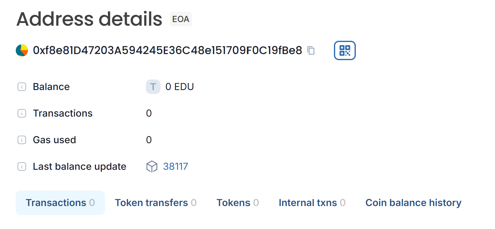

# Academic Certification and Scholarship DAO

The **Academic Certification and Scholarship DAO** is a decentralized application (DApp) built on the Ethereum blockchain. It aims to streamline the process of issuing academic certificates, verify student information, and allow donors to allocate votes for scholarship recipients. Let's dive into the details:

## Vision

Our vision is to create a transparent, secure, and efficient system for managing academic certificates and scholarships. By leveraging blockchain technology, we empower students, universities, and donors to participate in a trustless ecosystem.

## Project Features

1. **Certificate Storage and Verification**:
   - Students can securely store their academic certificates on the blockchain.
   - Certificates are associated with a unique student ID and include relevant details (name, type, hash, income certificate image, and CGPA).

2. **Donor Participation**:
   - Donors can register and contribute to the scholarship fund.
   - Donations are tracked transparently, and donors receive proportional voting power based on their contributions.

3. **Proportional Voting**:
   - Donors allocate votes (scores) to specific students.
   - Students with higher votes have a better chance of receiving scholarships.

4. **Immutable Records**:
   - Once stored on the blockchain, certificates and donation records are immutable.
   - This ensures data integrity and prevents tampering.

## Future Scope

1. **Integration with Educational Institutions**:
   - Collaborate with universities and colleges to directly issue certificates on the blockchain.
   - Explore partnerships with educational institutions for seamless integration.

2. **Enhanced Access Control**:
   - Implement more robust access control mechanisms.
   - Define roles (students, donors, administrators) and permissions for secure interactions.

3. **Smart Contract Upgrades**:
   - Plan for smart contract upgrades to accommodate future features.
   - Ensure backward compatibility with existing data.

## Project Structure

- **Smart Contracts**:
  - `AcadCerti.sol`: Main smart contract handling certificates, donors, and voting.
  - Structs: `Certificate`, `Donor`, and `Student`.
  - Functions: `storeCertificate`, `registerDonor`, `updateVotingPower`, `allocateVotes`, and retrieval functions.
- **Front-End Interface**:
  - Develop a user-friendly interface for students, donors, and administrators.
  - Connect to the Ethereum network using libraries like Web3.js or Ethers.js.
- **IPFS Integration**:
  - Store certificate images off-chain using IPFS (InterPlanetary File System).
  - Store IPFS hashes in the smart contract.
- **Testing and Deployment**:
  - Deploy the smart contract to a testnet (e.g., Ropsten) for testing.
  - Deploy to the Ethereum mainnet for production use.

## Developer Details

- **Lead Developer**: [Jakileti Srija]

## Deployment
Chain Name: Educhain Open campus
Contract Id: 0xf8e81D47203A594245E36C48e151709F0C19fBe8
